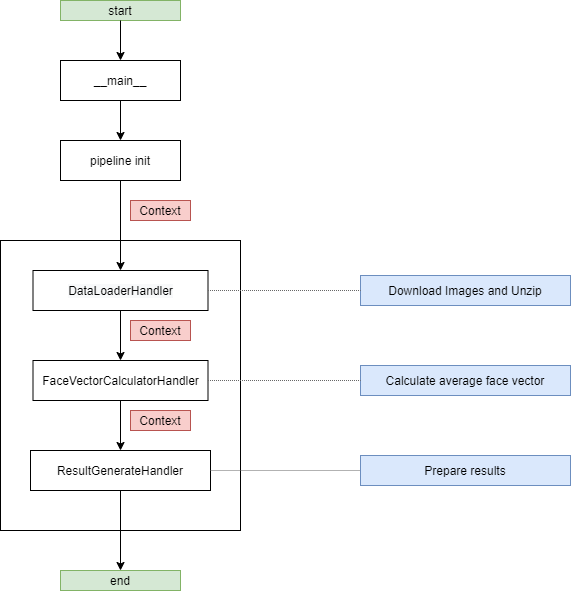
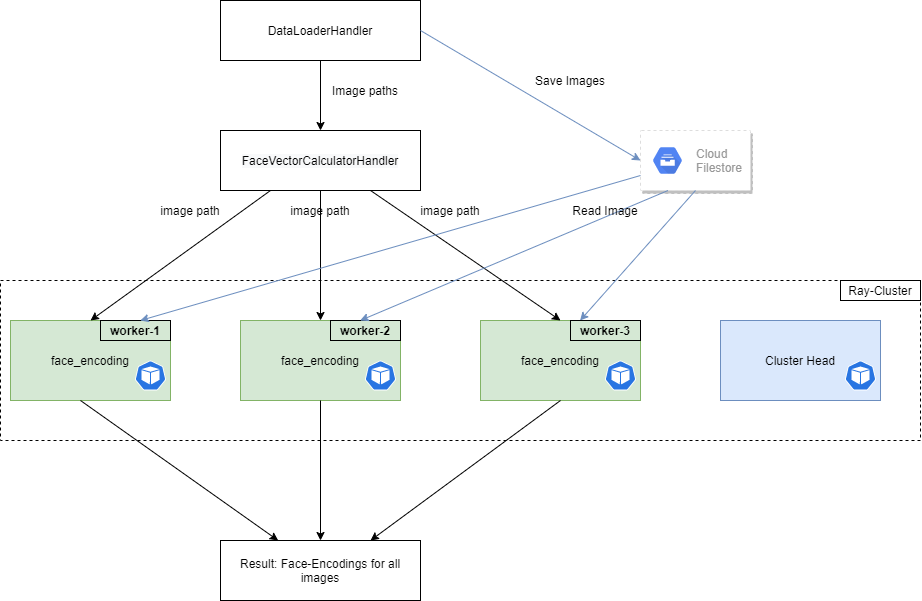
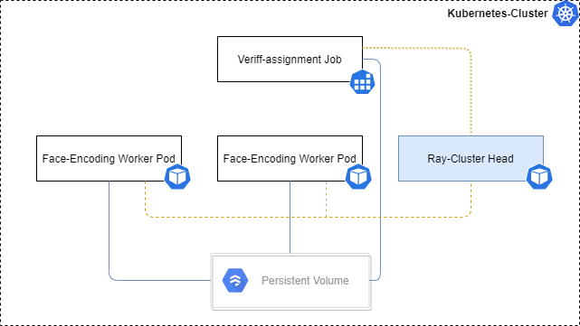
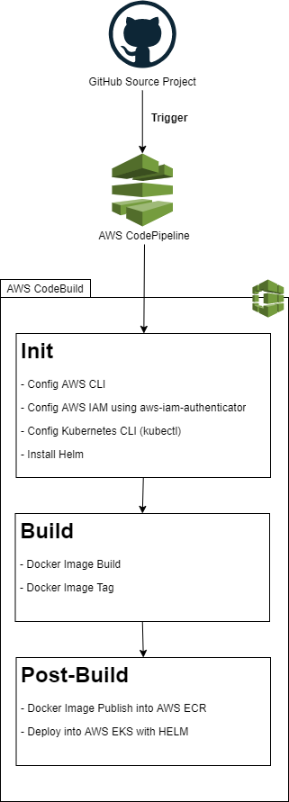
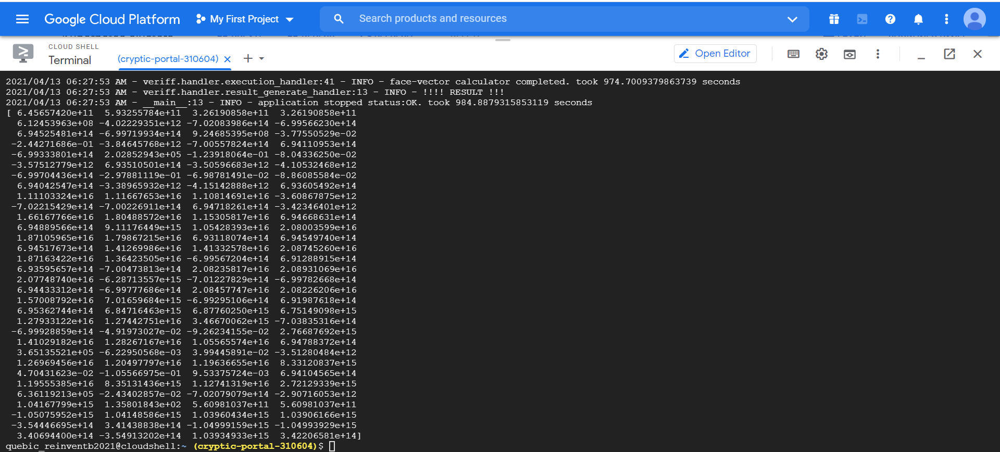

## Contents
* [Implementation](#implementation)
* [Solution for the Performance Improvement](#solution-performance-improvement)
* [CI/CD](#ci-cd)
* [Results](#results)

## <a name="implementation"></a>Implementation
#### The implementation of the solution mainly based on "Chain-of-Responsibility" design pattern.



## <a name="solution-performance-improvement"></a>Solution for the Performance Improvement
#### Problem
* Calculating face_encoding of each images in sequentially is a time consuming operation. When data set size is grow the latency will be increase.
#### Solution
* To improve the performance of face_encodings operation, we can process this function in a Distributed way.
* For that we can use Python [Ray](https://ray.io) distributed execution framework.
* We can setup Ray-Cluster and Workers. Then distributes the workload among each workers.
* Ray-Cluster automatically scale the Workers pool based on the load.
* All the Ray-Cluster setup configuration yaml contains inside the [ray](ray/cluster-setup.yaml) directory.


###### Ray-Cluster Setup on Kubernetes



## <a name="ci-cd"></a>CI/CD
#### There are lots of ways implement CI/CD, here we will use AWS stack.
##### CI/CD steps
 

##### More explanation
###### Build
* In the Build step, We ca use GIT commit sha as Docker Tagging version
* Sample yaml snippet.
```yaml
 build: # Build Docker image and tag it with the commit sha
    commands:
      - docker build . -t $IMAGE_REPO_NAME:$CODEBUILD_RESOLVED_SOURCE_VERSION -f <PATH_TO_DOCKER_FILE> 
      - docker tag $IMAGE_REPO_NAME:$CODEBUILD_RESOLVED_SOURCE_VERSION $AWS_ACCOUNT_ID.dkr.ecr.$AWS_DEFAULT_REGION.amazonaws.com/$IMAGE_REPO_NAME:$CODEBUILD_RESOLVED_SOURCE_VERSION
```

###### Post-Build
* We can use HELM upgrade command to deploy newest build Docker-Image into Kubernetes (AWS EKS).
* We can pass Docker-Image ID as an argument into HELM command.
* Sample yaml snippet.
```yaml
post_build:
    commands:
      - $(aws ecr get-login --no-include-email --region eu-west-3)
      - docker push $AWS_ACCOUNT_ID.dkr.ecr.$AWS_DEFAULT_REGION.amazonaws.com/$IMAGE_REPO_NAME:$CODEBUILD_RESOLVED_SOURCE_VERSION
      - helm upgrade -i <RELEASE_NAME> <PATH_TO_HELM_FILES> -f <PATH_TO_VALUE_FILES> --set image.tag=$CODEBUILD_RESOLVED_SOURCE_VERSION
```

## <a name="results"></a>Results
###### Average of Face Vectors
```json
[ 6.45657420e+11  5.93255784e+11  3.26190858e+11  3.26190858e+11
  6.12453963e+08 -4.02229351e+12 -7.02083986e+14 -6.99566230e+14
  6.94525481e+14 -6.99719934e+14  9.24685395e+08 -3.77550529e-02
 -2.44271686e-01 -3.84645768e+12 -7.00557824e+14  6.94110953e+14
 -6.99333801e+14  2.02852943e+05 -1.23918064e-01 -8.04336250e-02
 -3.57512779e+12  6.93510501e+14 -3.50596683e+12 -4.10532468e+12
 -6.99704436e+14 -2.97881119e-01 -6.98781491e-02 -8.86085584e-02
  6.94042547e+14 -3.38965932e+12 -4.15142888e+12  6.93605492e+14
  1.11103324e+16  1.11667653e+16  1.10814691e+16 -3.60867875e+12
 -7.02215429e+14 -7.00226911e+14  6.94718261e+14 -3.42346401e+12
  1.66167766e+16  1.80488572e+16  1.15305817e+16  6.94668631e+14
  6.94889566e+14  9.11176449e+15  1.05428393e+16  2.08003599e+16
  1.87105965e+16  1.79867215e+16  6.93118074e+14  6.94549740e+14
  6.94517673e+14  1.41269986e+16  1.41332578e+16  2.08745260e+16
  1.87163422e+16  1.36423505e+16 -6.99567204e+14  6.91288915e+14
  6.93595657e+14 -7.00473813e+14  2.08235817e+16  2.08931069e+16
  2.07748740e+16 -6.28713557e+15 -7.01227829e+14 -6.99782668e+14
  6.94433312e+14 -6.99777686e+14  2.08457747e+16  2.08226206e+16
  1.57008792e+16  7.01659684e+15 -6.99295106e+14  6.91987618e+14
  6.95362744e+14  6.84716463e+15  6.87760250e+15  6.75149098e+15
  1.27933122e+16  1.27442751e+16  3.46670062e+15 -7.03835316e+14
 -6.99928859e+14 -4.91973027e-02 -9.26234155e-02  2.76687692e+15
  1.41029182e+16  1.28267167e+16  1.05565574e+16  6.94788372e+14
  3.65135521e+05 -6.22950568e-03  3.99445891e-02 -3.51280484e+12
  1.26969456e+16  1.20497797e+16  1.19636655e+16  8.33120837e+15
  4.70431623e-02 -1.05566975e-01  9.53375724e-03  6.94104565e+14
  1.19555385e+16  8.35131436e+15  1.12741319e+16  2.72129339e+15
  6.36119213e+05 -2.43402857e-02 -7.02079079e+14 -2.90716053e+12
  1.04167799e+15  1.35801843e+02  5.60981037e+11  5.60981037e+11
 -1.05075952e+15  1.04148586e+15  1.03960434e+15  1.03906166e+15
 -3.54446695e+14  3.41438838e+14 -1.04999159e+15 -1.04993929e+15
  3.40694400e+14 -3.54913202e+14  1.03934933e+15  3.42206581e+14]
```

###### Performance
* Tested on 8 vCPUs, 32 GB Ram, GCP Kubernetes Engine.
* Took 16.45 minutes.
 
